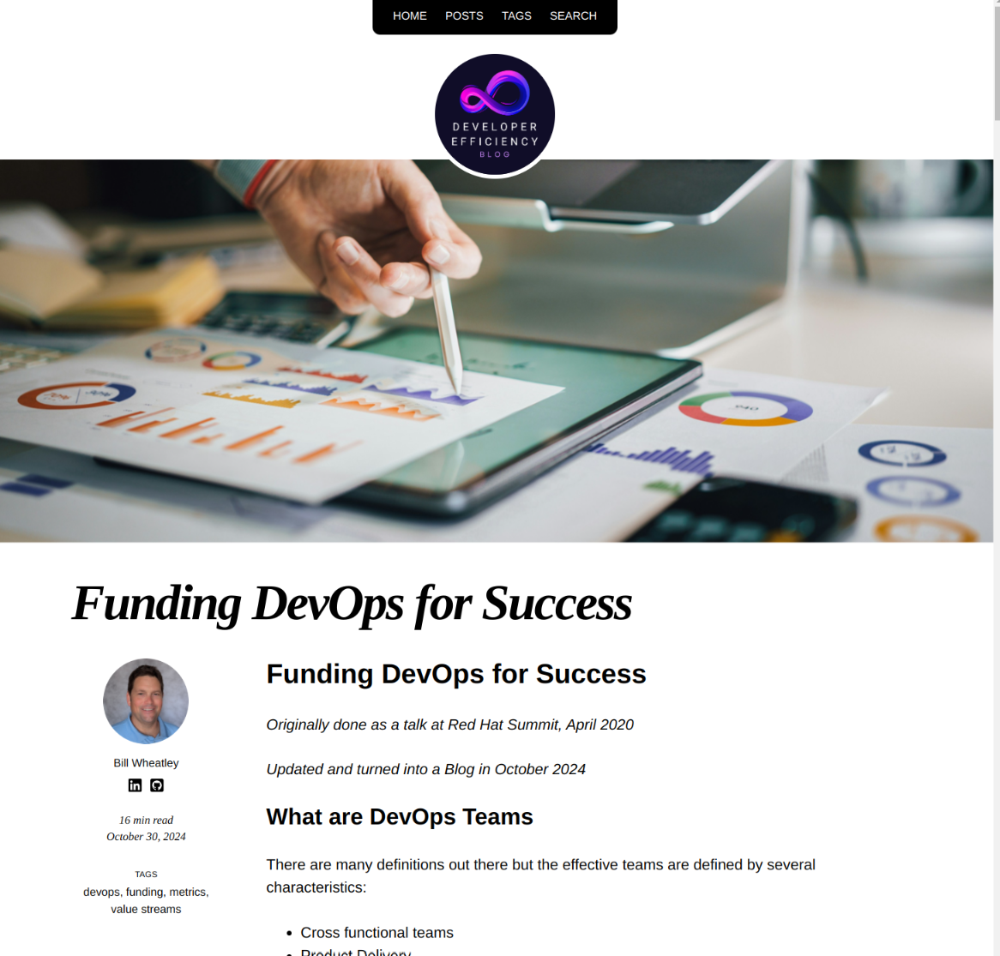

# Developer Efficiency Blog

This is the git backend for the [developerefficiency.com](https://developerefficiency.com/) blog

This is built with [Jekyll](https://jekyllrb.com/) + [So Simple theme](https://github.com/mmistakes/so-simple-theme?tab=readme-ov-file)

Running on an [nginx container](https://hub.docker.com/_/nginx) with production hosting by [DigitalOcean](https://www.digitalocean.com/)

## About the Blog

The goal of this a blog will be dedicated to exploring the strategies, tools, and practices that empower software development teams to work smarter, faster, and more effectively. From optimizing development workflows and leveraging automation to designing robust software architectures and aligning technology with business goals, this blog provides actionable insights and expert guidance for developers, architects, and IT leaders looking to enhance productivity and drive innovation. Whether you're navigating cloud adoption, implementing domain-driven design, or refining your DevOps practices, you'll find practical advice and thought leadership to help you succeed in today’s dynamic software landscape.

### Blog Article Preview



You can read the entire article [here](https://developerefficiency.com/2024/10/30/funding-devops-for-success.html) and discover more at [developerefficiency.com](https://developerefficiency.com/)

## Blog Stack

* **Git** - Backend Artifact Storage on GitHub
  * Articles written in markdown (A simple markup Language)
  * Container build artifacts
  * Jekyll configuration
  * Jekyll build artifacts
  * So Simple Jekyll theme artifacts and customizations
  * Backend technical documentation
* **Jekyll + So Simple Theme** - For converting Markdown to static HTML artifacts
* **Container Builder Image** - Builder Environment for running Jekyll builder
* **Container Runtime Image** - [nginx](https://nginx.org/) web server runtime environment to serve static HTML artifacts
* **Youtube** - For emended video hosting

### Production Environment

DigitalOcean App Platform PAAS is used for the production environment

* DigitalOcean App Platform CD (Continuos Delivery)
  * GitOps Methodology to build off GitHub hosted version of this Repo
    * `main` branch is production.
    * Rebuilds on any `main` branch change / push in [Bill Wheatley's developer-efficiency-blog repo](https://github.com/billwheatley/developer-efficiency-blog)
    * Uses GitHub application integration between the 2 services
    * By convention I am using branch based pull requests in GitHub to control changes to `main`
  * Produces Runtime container based off root level [Dockerfile](./Dockerfile)
    * Multistage Dockerfile: Build and Runtime stages
    * No shared container repo specific to this blog (as of now)
      * This means no intermediate builder images shared with dev environment
      * Dockerfile builds off common public images in Docker Hub every time CD is triggered w/o any pre-existing layers.
      * CD is a complimentary service with the DigitalOcean App Platform so I don't pay extra for using more build compute.
      * This approach does take a longer time to run but the build is still relatively quick so far.
      * Might add a container repo to the stack in the future for additional speed, more precise repeatability and/or image sharing in dev.
* Docker container hosting of runtime image.
  * SSL Routing included
* Monitoring of runtime container
* Auto restarts if runtime container crashes
* Currently running a single instance but opportunity for horizontal scaling (for an extra fee) if needed.  Design is extremely friendly to horizontal scaling since its stateless and has no backend at runtime.

### Local Development and Article Writing Environment

* Linux desktop (distro varies depending on which desktop I am using)
  * Side Note: you can build/configure of any one of my desktop environments starting from a few select distros freshly installed and using the [provision-desktop repo](https://github.com/billwheatley/provision-desktop) to automate the build.
* Local clone of git repo on desktop
* vsCode for artifact editing.
  * Added spell check plugin
  * Unfortunately no grammar check plugins available that I can find.
  * Used for final editing of markdown articles:
    * Add Jekyll specific headers to markdown, its specific to Jekyll and not standard to markdown
    * Image references [in the Jekyll way](#jekyll-and-image-references-in-markdown)
    * General cleanup of MD format some of other editors don't do well
  * Used to edit yaml configs
  * Used to edit *So Simple* theme artifact templates in markdown and HTML.
  * Used for README.md documentation editing
* Playing around with different markdown editors for article initial development.
  * First Attempt **vsCode**: have done initial development of markdown articles here before but lacks grammar checking.
  * Second Attempt **Google Docs**: Initial article development, export as Markdown, save as file in this repo, vsCode from there for final tweaking. Google Docs did some odd stuff with Markdown formatting that required me to do tedious changes to make the the markdown right for Jekyll.  If I land on this I might create a `sed` script to automatically cleanup their anti-patterns to Jekyll.
  * Future Attempt [StackEdit](https://stackedit.io/): Thinking about trying this one sometime for initial article development. Probably copy/paste after initial development into a file in this repo, vsCode from there for final tweaking.
* `podman`: Container build and runtime CLI front end.
* Containerized builder image
  * Dev builder artifacts are in [jekyll-builder/](./jekyll-builder/) folder.
  * [Builder image Dockerfile](./jekyll-builder/Dockerfile) is custom, it has the base of the theme built in.
  * No shared container repo specific to this blog (as of now).
  * Must build the *container builder* image locally to use it. Builder image is built off of common public images and libraries.
  * Similar copy/paste Dockerfile code to the builder stage of the production container image build.
  * Builder image is used as a short lived container to generate the site in static html with Jekyll.
  * The generated static site html artifacts root directory is mounted from the local file system into the build container [see jekyll-builder/README.md](./jekyll-builder/README.md)
* Containerized nginx Runtime
  * Uses the official nginx image on docker hub w/o modifications (in dev)
  * The generated static site html is mounted into the nginx container where nginx can server these up.
* Browser pointed to the local running nginx container to preview and verify look and feel.
  * Simple browser refresh (after builder is incrementally run) is all that is needed between iterations of editing to see changes.
* GNU Image Manipulation Program (GIMP) for image editing.

## Repo Structure

```console
.                   # Root Directory of project
├── content         # Non-generated Jekyll content
│   ├── assets      # Images I use thought the blog
│   ├── _data       # So-Simple Global theme configuration
│   ├── _includes   # So-Simple artifacts, some modified
│   ├── _layouts    # So-Simple layout artifacts, some modified
│   └── _posts      # The blog posts
└── jekyll-builder  # Development builder image
```

### Jekyll and Image References in Markdown

The way Jekyll assembles the static HTML and artifacts, it puts html output of `_posts` into a different directory structure then the equivalent markdown file lives in.  This makes relative references to image assets incompatible between standard markdown viewing and the compiled html website.

Example, a markdown file in `content/_posts/2024-08-08-mbpm.md` might reference an image like this:

```markdown

```

This would be valid reference to the image in the markdown given the file structure of the repo.

However the Jekyll build will layout the relevant compiled assets like this:

```console
<output dir>
├── 2024
│   └── 08
│       └── 08
│           └── mbpm.html
└── assets
    └── mbpm-1.png
```

It does not replace the image reference. Thus the file `2024/08/08/mbpm.html` would render this html ``, making a relative reference to an image that is invalid in this directory structure.

What I have decided to use absolute references instead, which will be invalid in markdown. Other assets references that Jekyll and the *So Simple* theme add in, all use absolute references to `/assets`, so I am going with it. In markdown posts image references will look like this:

```markdown

```

The `<output dir>` will be in copied into a standard nginx container to the default html root at `/usr/share/nginx/html`.  This will make `http://<my-server>/assets/mbpm-1.png` a valid reference when running on a web server.

## Building and running an instance of this blog locally

### Production Build

This is good for testing the final container image locally that will be built by DigitalOcean App Platform CD.

In the Root directory run:

```console
# Run the Build
podman build -t developer-efficiency-blog:latest .

# Once built, you run it:
podman run -d --name developer-efficiency-blog -p 8080:80 developer-efficiency-blog:latest
```

Now you can hit http://localhost:8080 with your browser and check it out

Cleaning up:

```console
# To Stop it:
podman kill developer-efficiency-blog

# To start it backup (if you like the command options from the initial run command)
podman start developer-efficiency-blog

# If you want to delete the developer-efficiency-blog run definition:
podman kill developer-efficiency-blog
podman rm developer-efficiency-blog
```

### Development Build

If you want to work in an iterative manner, building and reloading quickly [see jekyll-builder/README.md](./jekyll-builder/README.md)

## Adding Blog Articles Guide

New Articles go under `content/_posts/` directory, the file name is in the pattern `yyyy-MM-dd-my-blog-topic.md`

### Jekyll Header

All finalized Markdown blog files need this header, it starts at the very first line, here is a template

```yaml
---
title: "My Pretty Print Title"
layout: post
author: bill_wheatley
date:   YYYY-MM-dd 00:00:00 -0500
tags: 
  - Tag 1
  - Tag 2 
image:
  thumbnail: /assets/my-thumbnail.png
  path: /assets/my-blog-banner.png
---
```

NOTES:

* `author` must match an author in `content/_data/authors.yaml`
* `date` Make sure it matches the file name
* `tags` is a free form list but make sure they line up with exiting tabs (case sensitive), check the [website](https://developerefficiency.com/tags/) for current tags to make sure you are in sync
* `image.thumbnail` This should be used, it shows up in blog post listings, it can be a repeat of the banner image
* `image.path` This is required, It's the banner image
  * These can be over barring, the wider you make it relative to hight, the less ridicules it looks
  * If you want that area to appear blank, use: `/assets/empty-wide.png` its a very wide and short blank image that will not break the page

### Obtaining Stock Images

I like [Unsplash](https://unsplash.com/) for royalty free photos.

I like [Canva](https://www.canva.com/) for royalty free editable designs (generated images)

Use an image editor if you need to crop or manipulate

## Why I built the blog this way?

### It's wins (for me) between the alternatives

Everything is comparative. I wanted to own this website and control its destiny.

Building software from complete scratch doesn't sound like how I want to spend my time when plenty of already written things, so that use case is out.

Using Software as a *Shared* Service such as `wordpress.com` or `blogger.com` can limit what you can do giving some amount of control and data up to the website operator which allows them to monetize you and your readers. I scratched this use case off.

`substack.com` is another Software as a *Shared* Service, it seems interesting and has subscriber based monetization opportunities. In this model the operator takes a cut of subscription fees you bring in from your loyal readers. At this time I don't want to monetize in that manner but it sounds compelling.

The next pattern to consider is using the WordPress software. WordPress is Open Source software and by controlling the blog at the hosting level you open more control to yourself.  There are many patterns to host this, a popular way is to get a hosting service that sets up the entire stack for you but gives you the control to configure, access backend components and change the service as you see fit. This is an extremely popular choice on the internet and my second choice behind a "Jekyll blog".

The following sections explain why a Jekyll blog attracted me.

### My Developer Background

Anyone wanting to put together a Jekyll blog is likely going to require a developer background.  There are many ways to do it and Jekyll itself is just one of many components to having a running blog.  

This type of thing is what I done professionally so it so easy for me. I end up treating the blog article like building enterprise software which to me offers a number of advantages I don't get on any of the above options.

### Familiarity

I have been part of a team in the past that documented our work in a Jekyll blog (or wiki as we called it).  We shoved MS Word docs and Sharepoint aside and it was glorious. To be fair I haven't used WordPress but I can imagine some of the experiences operating a blog designed the way its done and user testimonies on the Internet confirmed my concerns.

### Production Efficiency and Future Costs

When I think about costs for me I am mostly thinking about professional hosting, what does it cost to run this in production?

Since a Jekyll blog in production is just serving up static HTML with nginx, there is relatively low cpu, memory and disk space required to that.

Certainly compared to a WordPress that has to run a database, and an application to generate the HTML on the fly for every request. You could cache pages in WordPress with a plugin but that is now an additional component on top of all that.

The simplicity of the Jekyll blog also creates a very reliable system and fast response times for the user. The compute per request has to be dramatically lower compared to WordPress. When it is time to scale, which should come later with Jekyll, its both vertically and horizontally scalable. With it containerized the horizontal scaling can be dynamic depending on the production runtime platform.

To be fair I still have to run some compute to turn markdown into HTML but I don't need 99.99% uptime production environment to run a build.  I can run that on a much lower reliability type of environment which means lower cost. I also get the advantage of running that conversion process much less often than a WordPress site doing that on every user page load.

### Runtime Security

This is probably my biggest concern with self managed WordPress blogs, the security is notoriously bad. WordPress blogs are being constantly exploited.  It's a much harder model to secure as your site and much of its configuration lives in a mutable database that the front end has permissions to change. If a hacker gets in that database you could lose data, even if you have a backup, unless its a versioned backup or you catch it in time your backup might get corrupted too.

The Jekyll stack I am using sources things through a series of build steps, that flows one way away from my source data in git.  In the end its dropped into an ephemeral container with no backend in production, a hacker getting into that is a container restart away from full restoration of an attack. My backend data store, git, was designed as a decentralized system and its effortless to backup `git clone ...`, not that I would have much concern to begin with GitHub security. The blog build out is automated so recreating it is also nearly effortless to restore.

### Change Control and History is so Much Better

With the type of setup I am using, git source control is the hub of change management and history. All the history is stored, I can branch and the tools are second to none for inspecting history and restoring, merging, reverse merging, etc.

WordPress you can save drafts before you publish which only applies to the articles, other things like plugins, changes to look and feel happen in production and hopefully it looks good because any users reading your blog at the time are going to see the change when you make it. While drafts are a simple way to control changes, it is far more simplistic then git and pull requests. Once the article is published on WordPress, I am assuming there is really no history there, its just the one version. With git I have a full accounting of the history, if I was in a multi user environment this would be huge.

### Ultra Portability and Replicability

One thing I have seen throughout my professional life is customers that got themselves locked in and stuck somewhere. They end up being held for ransom that was craftily set at a price that is just at the right level that it would be too expense to migrate to something else. I always ask myself at the start how easy is it to walk away from any part of the system. Also what are the chances I will have to walk away?

The good news is when you control who is doing the hosting, using generic patterns and use open source software you have a massive advantage over a single service provider or commercial off the shelf software.

After you establish that it is possible to move hosting, to what level of effort does it take to move hosting. Here WordPress is not easy, you need to replicate plugin setup and replicate your database and chances are you don't have much practice doing this.  This Jekyll blog is ultra simple.  It's a container which has a common interface to run things. With my current setup I would also need to move CD (continues delivery) but there is not much to that. The normal flow of things with this stack makes drooping off that final container for production much easier.

In addition I made sure that I control the production domain name so I could re-point it to a new hosting service if I wanted to change.

Of course there is more than hosting, the software is something to consider as well. Most of this stack is pretty solid and built on commonly used things and WordPress software is pretty common too. I might give WordPress a little bit of an edge to live on longer on an as-is basis over the stack I am using but feel I have a more likely to have the opportunity of re-mixing this stack easier if something deprecates.

#### A Dev (or Draft) environment

Having multiple environments is a common software development practice that carries over here. I can go through an iterative process that could be simple changes to a radical remake this blog without effecting production until I am ready and everything looks good. This is due to the highly portable and replicable nature that this stack gives me. WordPress is hard to replicate across running instances. The WordPress model pushes you to work in a single environment where you have to make changes as your users are using it.

## Contacting Bill Wheatley

If you are interested in contacting Bill please visit [Bill's LinkedIn page](https://www.linkedin.com/in/bill-wheatley/)
