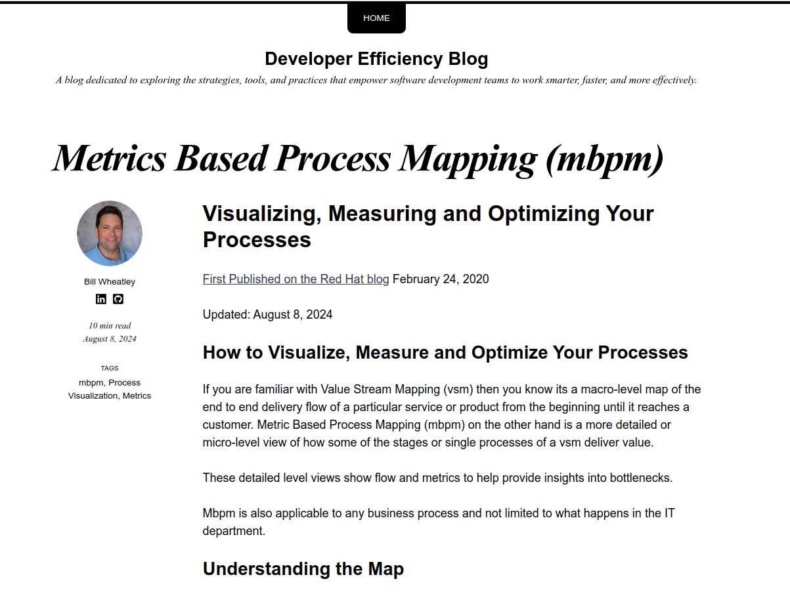

# Developer Efficacy Blog

Currently this is not hosted in a production environment as of yet but is expected to be launched sometime in November 2024. Production hosting details have not been finalized yet.

## About the Blog

The goal of this a blog will be dedicated to exploring the strategies, tools, and practices that empower software development teams to work smarter, faster, and more effectively. From optimizing development workflows and leveraging automation to designing robust software architectures and aligning technology with business goals, this blog provides actionable insights and expert guidance for developers, architects, and IT leaders looking to enhance productivity and drive innovation. Whether you're navigating cloud adoption, implementing domain-driven design, or refining your DevOps practices, you'll find practical advice and thought leadership to help you succeed in today’s dynamic software landscape.

### Sneak peak

## How this repo relates to the blog

This is the git repo to house artifacts for the blog and task track myself for this blog.  

This blog is built with [Jekyll](https://jekyllrb.com/) + [so simple theme](https://github.com/mmistakes/so-simple-theme?tab=readme-ov-file). Jekyll is a tool that takes content written in Markdown along with yaml configuration and plugins to generates a set of static html pages that work like a blog site.  These pages will be severed up in the near future for easy web browser viewing.

Please note in this repo that the Markdown has some links and elements that are geared to the Jekyll way of doing things and don't make complete sense as pure markdown viewed in Github.

## Contacting Bill

If you are interested in contacting Bill please visit [Bill's LinkedIn page](https://www.linkedin.com/in/bill-wheatley/)
